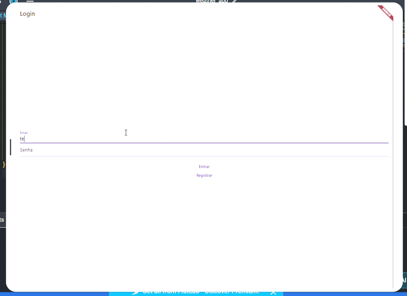
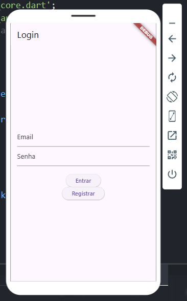
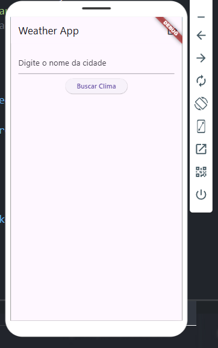

# 🌦️ Weather App - Aplicação Flutter com API e Firebase

Este é um aplicativo mobile desenvolvido em **Flutter**, que exibe informações meteorológicas em tempo real por meio do consumo de uma API pública. A aplicação também está integrada ao **Firebase** para autenticação de usuários.

## 📱 Demonstração

📽️ **Vídeo do projeto:**  

📷 **Prints da aplicação:**

| Tela de Login               | Tela Principal               |
|----------------------------|------------------------------|
|  |      |

---

## 🚀 Funcionalidades

- ✅ Login com Firebase Auth
- ✅ Tela de autenticação e redirecionamento automático
- ✅ Consumo da API de clima para exibir dados meteorológicos atuais
- ✅ Suporte a múltiplas plataformas (Android e Web)
- ✅ Interface responsiva e simples de usar

---

## 🔗 Link para Testar

- 📦 [Clique aqui para baixar o APK](https://api.flutlab.io/projects/2556029/download-app?key=h1xvvilecnuft3bromch&target=web-release)

---

## 🔧 Como Executar Localmente

Clone o repositório e instale as dependências:

bash
git clone https://github.com/thalesleall/dev-mob-weather-app.git
cd weather-app
flutter pub get
flutter run

---

🔑 Configuração do Firebase
Já incluso o arquivo firebase_options.dart, gerado automaticamente com base no google-services.json.

🔌 Tecnologias Utilizadas
Flutter

Firebase Authentication

API de clima (ex: OpenWeatherMap, WeatherAPI ou outra)

Dart

Material Design

---
📁 Estrutura do Projeto
lib/
├── main.dart
├── firebase_options.dart
├── screens/
│   ├── login_screen.dart
│   └── home_screen.dart
└── services/
    └── weather_api.dart

---
📜 Licença
Este projeto é acadêmico e foi desenvolvido como parte da disciplina de Desenvolvimento Mobile.

👨‍🏫 Informações Acadêmicas
Aluno: [Thales Vinicius Leal Barcelos]

Curso: Engenharia de Software 

Instituição: [Uni-FACEF]

Disciplina: Desenvolvimento Mobile I

Professor: [Marcio]

